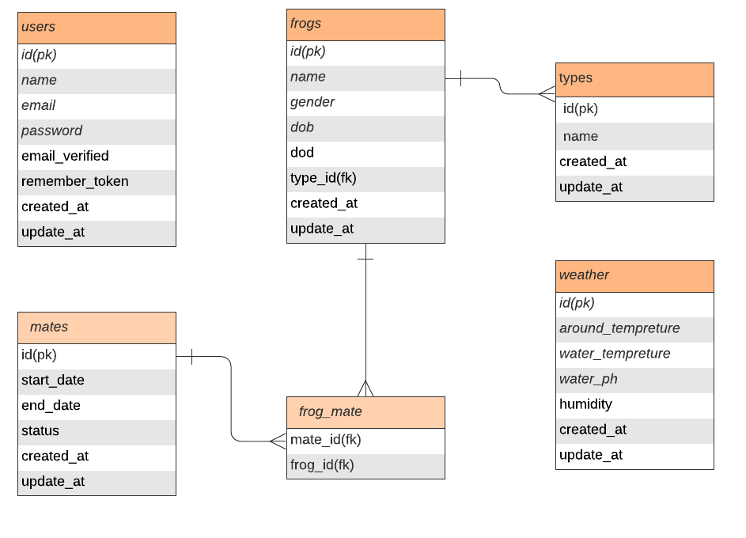

## Requirements
    - php 7.2.5 or higher
	- node
	- MySQL
	
## Freamework
 - Laravel - 7.30.6
 
## How to run the app
	1. Create database “frogs” and link database in .env
	2. Open your terminal and
		a. cd to ~/project/src/frog-manager folder
		b. install npm packages and run web pack
			i. npm intall
			ii. npm run dev
		c. install vendors
			i. composer install
	3. Run database migrations and seeds
        a. php artisan migrate
	    b. php artisan db:seed
	4. Congrats, all done. Let’s run the app 
		a. php artisan serve
		b. access app using your favourite browser
		
Having trouble ? feel free to check official [installation guide](https://laravel.com/docs/8.x/installation)
		
## Why Laravel
	- Laravel provides easy and fast working environment for rapid web application development
	- Laravel helps to simplify development process with clean and reusable code

## Assumptions
   - Only authorized users are able to access the app
   - User can record,maitian: Frogs, Mating and Weather data using the app
   - User are able to manage different frog species 
   - Only two(male + female) frogs are mated in one attepmt
   - Single frog can be mated many times and mating has many frogs 
   - In mating frogs can be mated only after ongoing process completed 
   - Weather data are manually updated by user

## Design patterns
	- Repository pattern
	- Service layer pattern
	- SOLID
	- These patterns ensure clean, sustainable and reusable code base

## Database design 
	- Database was designed with help of above assumptions

